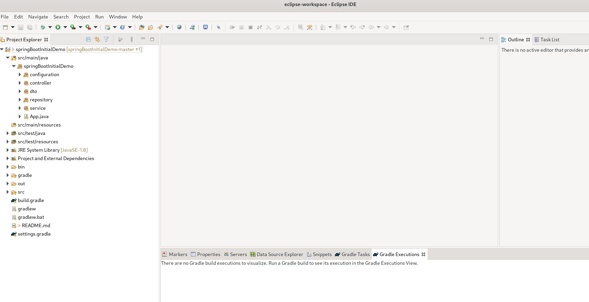

## Spring Boot Initial Project

This app contains the structure of an extensible microservice, with separation of layers and all its components.
Main pattern used is MVC (Model-View-Controller) or, rather, an evolution of this pattern.

### MVC Pattern

**_IMPORTANT_:** Microservices _**NOT contains**_ View Layer _per se_.
A Java microservice **does NOT** have HTML files, images,  or anything that user can see in their browser.
**_Microservices are not web applications._**

View Layer is only showed in a Rest API exposed, that can receive HTTP requests, interact with oter microservices, etc... 
but always in backend. Microservices needs an containerized environment (using Docker, for example) to run.
You can learn more about Docker in [Official Guides](https://docs.docker.com/).

### Project Folders & Files

- **main/java/springBootInitialDemo**.
    - **configuration**.
        - SpringConfiguration. Basic configuration to start app.
        - WebMVCConfiguration. Basic configuration to load resources located in app folders
    - **controller**
        - InitialController. This class contains mappings of differents URL exposed to manage and send HTTP responses.
    - **dto**. DTO is an acronym of **D**ata **T**ransfer **O**bject. A DTO is a stateless wrapper object that not 
      contains business logic. A DTO encapsulates the data that "travels" through the app, and it's send to view.
    - **repository**.
      This folder contains Interface & Implementation of Repository Pattern.
        - IRepository.
        - UserRepository.

        Repository Layer is usually used with JPA (Java Persistence API), the Java API that allows access to persistence 
          layer. Best Pratices say that there must be a repository for each entity type (a entity is a stateless object 
          that represents a database record). See [Martin Fowler's explanation](https://martinfowler.com/eaaCatalog/repository.html).
    - **service**
      Service Layer exposes main functionalities accesed by controllers. Belongs to Model Layer and is responsible for 
      exposing the business logic main actions.
    - App.java. Entry point of microservice.  
    
- **main/java/resources**. Other necessary resources.
- **test/java/springBootInitialDemo**. Contains unit tests (and other test types).

**_WARNING_**: In projects, we will not necessarily find the separation of layers organized by folders. The folder structure
is not the same as the separation of application layers.

### More Important Spring Annotations

Spring Annotations help us to signalize different layers of the App:
- **@RestController**. Controller of the app (one of them).
    - **@RequestMapping("/v1")**. Part of URL requested.
    - **@GetMapping("/test")**, **@PostMapping**. Receive GET/POST/anotherHTTPVerb requests.
- **@Repository**. Repository Layer.
- **@Autowired**. Object Injected (Dependency Injection). Spring instantiates it for us and injects it in the constructor 
  that we indicate
- **@Transactional**. Only for Repository, for transactional operations.
- **@Component**. Stateless wrapper object, or perhaps other helper object.

### Import project to IntelliJ

Follow next steps:
- Open IntelliJ.

 
- Select **Open** option.

  
- Navigate to the folder containing the project.

### Import project to Eclipse
- Navigate to menu File > Import

- Select Gradle / Existing Gradle Project and press 'Next'

- Select Project Root Directory as images below shown, and press 'Finish'

- Now you can see the workspace with the project ready to work

